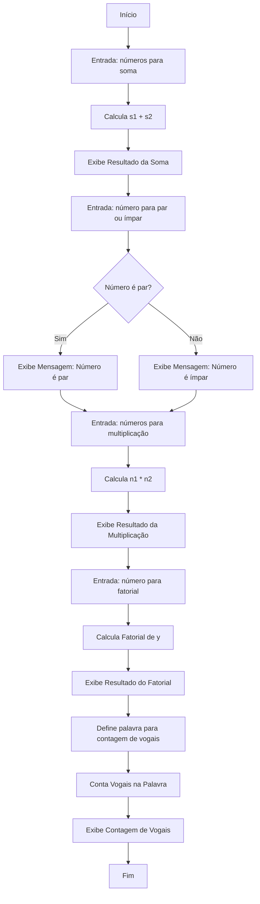
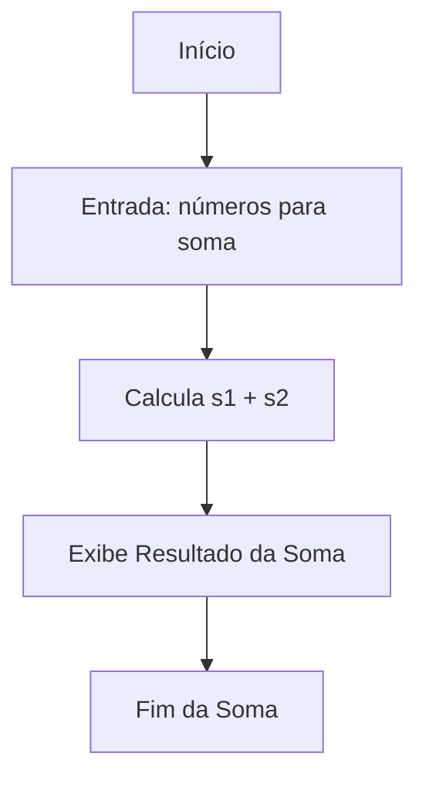
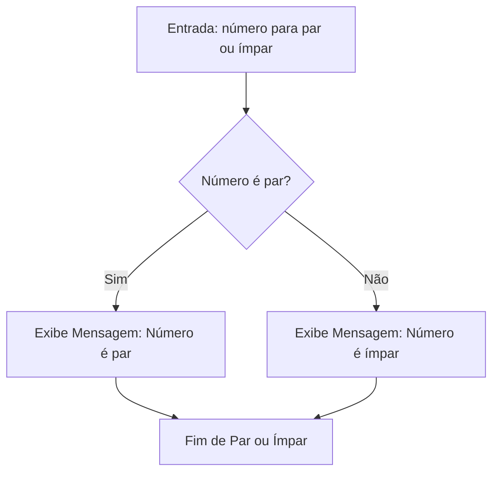
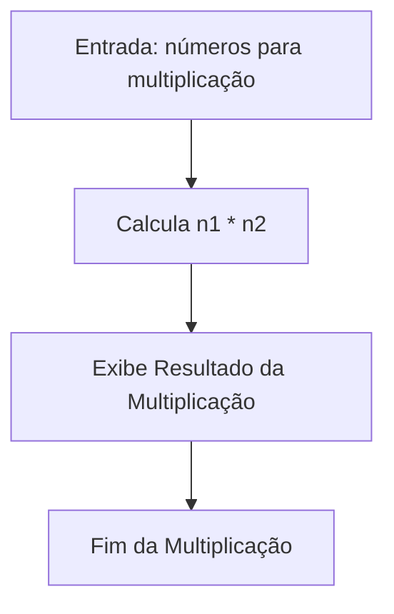
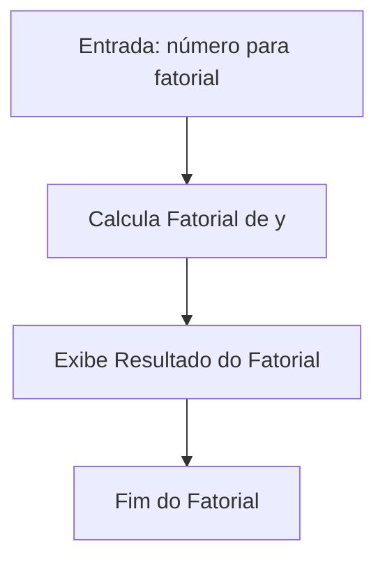
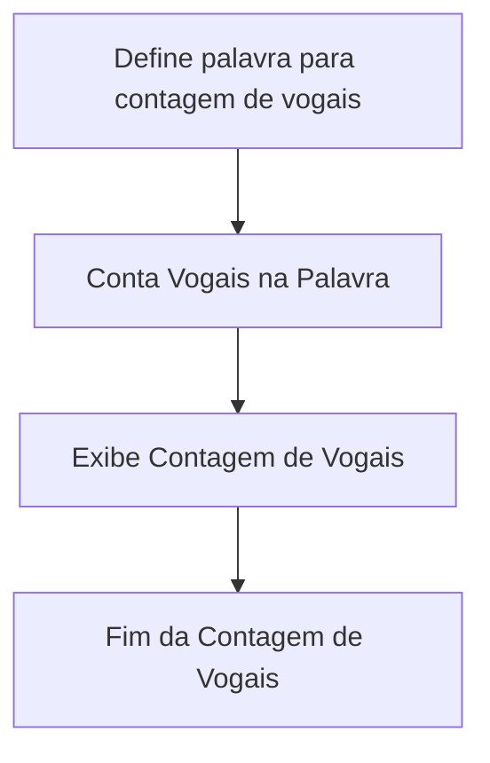

# Projeto MK Challenge

Esse projeto tem como objetivo resolver uma série de desafios de algoritmos básicos propostos pela MK Solutions visando a vaga de Jovem Aprendiz.

### No projeto consta:

- Solução para 5 desafios de algoritmos básicos, sendo eles:
    
    1. Soma
    2. Par ou ímpar
    3. Tabuada (Multiplicação)
    4. Fatorial
    5. Contagem de vogais em uma palavra

- Fluxograma referente ao funcionamento do código;

- Descrição do código-fonte em blocos correspondentes a cada desafio.

### Dev do Projeto
- Davi Hoffmann

## MK_Challenge
A linguagem de programação escolhida para a realização do desafio foi C#, o código-fonte pode ser encontrado [aqui](https://github.com/Hoffmann365/MK_Challenge/blob/main/Program.cs).

### Fluxograma
O Fluxograma a seguir mostra o funcionamento do código.


### Descrição do Código Fonte

Bibliotecas utilizadas no Projeto:
```c#
using System;
using System.Runtime.Intrinsics.Arm;
```

Soma:



1. Variáveis:
```c#
int s1 = 0;
int s2 = 0;
int s3 = 0;
```
Foram utilizadas 3 variáveis:
-  `s1` que armazena o primeiro número da soma
-  `s2` que armazena o segundo número da soma
-  `s3` que armazena o resultado da soma entre `s1` e `s2`.

2. Entradas:
```c#
Console.WriteLine("Olá! Vamos realizar a soma de dois números");
Console.WriteLine("Insira o primeiro número: ");
s1 = int.Parse(Console.ReadLine());
Console.WriteLine("Insira o segundo número: ");
s2 = int.Parse(Console.ReadLine());
```
Nesse bloco de código é informado por meio de uma mensagem que vai ser realizada a soma de dois números, e, após isso, é solicitado ao usuário digitar os números que vão ser somados. O primeiro número é armazenado em `s1` e o segundo número é armazenado em `s2`. 

3. Realização da Soma:
```c#
s3 = s1 + s2;
```
Nessa linha é realizado a soma entre os dois números e o resultado da operação é armazenado em `s3`.

4. Saída:
```c#
Console.WriteLine($"{s1} + {s2} = {s3}");
```
Essa linha exibe o resultado da soma no console. Ex: "2 + 2 = 4".

Par ou Ímpar:



1. Variaveis:
```c#
int x = 0;
```
`x` armazena o número a ser identificado como par ou ímpar.

2. Entrada:
```c#
Console.WriteLine("\nOlá novamente, agora vou lhe informar se um número é par ou ímpar.");
Console.WriteLine("Insira o número:");
x = int.Parse(Console.ReadLine());
```

Nesse bloco de código é informado por meio de uma mensagem que vai ser realizada a identificação se o número é par ou impar, e, após isso, é solicitado ao usuário digitar o número. O número é armazenado em `x`.

3. Verificação e Saída:
```c#
if (x % 2 == 0)
{
    Console.WriteLine($"{x} é um número par");
}
if (x % 2 != 0 )
{
    Console.WriteLine($"{x} é um número ímpar");
}
```
Nesse bloco de código é verificado se um número é par ou impar por meio do operador `%` (módulo). Caso o número seja par, o resultado da operação por 2 é igual a zero e é exibido no console que o número é par. Caso o resultado seja diferente de zero, o número é ímpar e é exibido no console que o número é ímpar.

Tabuada (Multiplicação):



1. Variáveis:
```c#
int n1 = 0;
int n2 = 0;
int n3 = 0;
```
Foram utilizadas 3 variáveis:
-  `n1` que armazena o primeiro número da multiplicação
-  `n2` que armazena o segundo número da multiplicação
-  `n3` que armazena o resultado da multiplicação entre `n1` e `n2`.

2. Entrada:
```c#
Console.WriteLine("\nVamos realizar uma multiplicação agora.");
Console.WriteLine("Insira o primeiro número: ");
n1 = int.Parse(Console.ReadLine());
Console.WriteLine("Insira o segundo número: ");
n2 = int.Parse(Console.ReadLine());
```

Nesse bloco de código é informado por meio de uma mensagem que vai ser realizada a multiplicação de dois números, e, após isso, é solicitado ao usuário digitar os números que vão ser multiplicados. O primeiro número é armazenado em `n1` e o segundo número é armazenado em `n2`.

3. Realização da Multiplicação:
```c#
n3 = n1 * n2;
```

Nessa linha é realizado a multiplicação entre os dois números e o resultado da operação é armazenado em `n3`.

4. Saída:
```c#
Console.WriteLine($"{n1} x {n2} = {n3}");
```
Essa linha exibe o resultado da multiplicação no console. Ex: "8 x 5 = 40".

Fatorial:



1. Variáveis:
```c#
int y = 0;
int fatorial = 1;
string parcial;
string answer = "";
```
Foram utilizadas 4 variáveis:
-  `y` que armazena o número o qual vai ser calculado o fatorial
-  `fatorial` que armazena a multiplicação acumulada para calcular o fatorial
-  `parcial` que armazena partes da string que vai formar o cálculo. Ex: "x 4", "x 3", etc.
- `answer` string que armazena o cálculo do fatorial. 

2. Entrada:
```c#
Console.WriteLine("\nQue tal realizarmos o fatorial de um número agora?");
Console.WriteLine("Vamos lá!");
Console.WriteLine("Insira o número:");
y = int.Parse(Console.ReadLine());
```

Nesse bloco de código é informado por meio de uma mensagem que vai ser realizado o cálculo do fatorial de um número, e, após isso, é solicitado ao usuário digitar os número que vão ser calculado. O número é armazenado em `y`.

3. Estrutura incial da resposta:
```c#
answer = $"Fatorial de {y}: {y} ";
```
Nessa linha é armazenado na variável `answer` a estrutura inicial do cálculo. Ex: "Fatorial de 5: 5".

4. Loop e Cálculo
```c#
for (int i = y - 1; i > 0; i--)
{
    fatorial *= i + 1;
    parcial = $"x {i} ";
    answer += parcial;
}
```
Nesse bloco de código é utilizado um loop `for` para repetição, o loop começa com `y - 1` porque o fatorial de um número é calculado como a multiplicação desse número pelos números que vêm antes dele (5! = 5 * 4 * 3 * 2 * 1). O cálculo que é feito dentro do loop se divide em 3 partes:

- **`fatorial *= i + 1;`** : Esta linha atualiza a variável `fatorial`. O operador `*=` multiplica o valor de `fatorial ` pelo resultado de `i + 1`(utiliza-se `i + 1` pois assim retorna o valor de `y`).
-  **`parcial = $"x {i} ";`** : Esta linha constrói uma parte da string que mostra a parte visual da multiplicação utilizando o valor de `i`. Ex: "x 4", "x 3", etc.
- **`answer += parcial;`** : Esta linha serve para concatenar o valor de `parcial` à string `answer`, construindo a expressão completa da multiplicação ,adicionando cada fator do fatorial à string final.

5. Saída:
```c#
Console.WriteLine($"{answer}= {fatorial}");
```

Esta linha de código vai exibir o resultado do fatorial no console, concatenando a expressão da multiplicação (`answer`) com o resultado final (`fatorial`). Ex: "Fatorial de 5: 5 x 4 x 3 x 2 x 1 = 120"

Contagem de vogais em uma palavra:



1. Variáveis:
```c#
string palavra = "Programação";
int contagemVogais = 0;
char[] vogais = { 'a', 'e', 'i', 'o', 'u', 'A', 'E', 'I', 'O', 'U',
                'á', 'é', 'í', 'ó', 'ú', 'Á', 'É', 'Í', 'Ó', 'Ú',
                'ã', 'õ', 'â', 'ê', 'ô', 'Ã', 'Õ', 'Â', 'Ê', 'Ô' };
```
Foram utilizadas 3 variáveis:
-  `palavra` que armazena a palavra na qual será realizada a contagem
-  `contagemVogais` que armazena a quantidade de vogais que tem na palavra
-  `vogais` que é uma array de char que armazena as vogais para comparação

Obs: Não utilizei um input pelo console para digitar a palavra, pois dessa forma não estava aceitando caracteres especiais.

2. Mensagem de aviso:
```c#
 Console.WriteLine("\nVou lhe informar a quantidade de vogais contidas em uma palavra.");
```
Essa linha de código informa por meio de uma mensagem que vai ser contado a quantidade de vogais de uma palavra.

3. Contagem de vogais:
```c#
for(int i = 0; i < palavra.Length; i++)
{
    if (Array.Exists(vogais, v => v == palavra[i]))
    {
        contagemVogais++;
    }
}
```

Nesse bloco de código é utilizado um loop `for` para repetição, para percorrer cada letra da palavra. Dentro do loop é utilizado o método `Array.Exists` que recebe como parametro a array `vogais` e como predicado ele recebe uma expressão lambda `v => v == palavra[i]`. Esse método verifíca se a letra que esta sendo verificada contém dentro da array `vogais`, se tiver ele retorna `true`, caso não tenha, ele retorna `false`. Se o resultado for `true` a variável `contagemVogais` é incrementada em 1.

4. Saída:
```c#
Console.WriteLine($"A palavra \"{palavra}\" tem {contagemVogais} vogais");
```
Essa linha de código exibe a quantidade de vogais contidas na palavra no console. Ex: "A palavra "Programação" tem 5 vogais".
